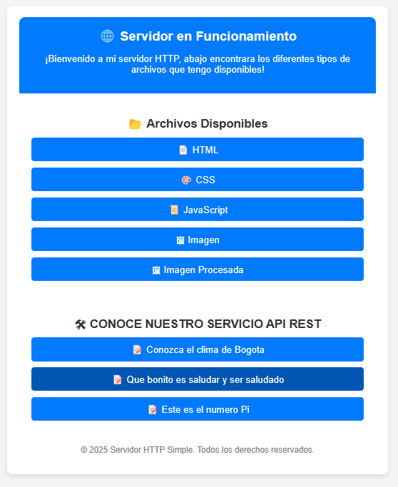

# Escuela Colombiana de Ingeniería
# Arquitecturas Empresariales

## Taller 2 Desarrollo de marcos web para servicios REST y gestión de archivos estáticos

Se trabajo sobre el primer servidor http, y se agregaron las respectivas mejra para implementar marcos WEB para los servicios REST , y sumado a esto se introdujo un método que permita a los desarrolladores definir la carpeta donde Se encuentran los archivos estáticos

---
### Prerrequisitos

* [Maven](https://maven.apache.org/): Es una herramienta de comprensión y gestión de proyectos de software. Basado en el concepto de modelo de objetos de proyecto (POM), Maven puede gestionar la construcción, los informes y la documentación de un proyecto desde una pieza de información central.
* [Git](https://learn.microsoft.com/es-es/devops/develop/git/what-is-git): Es un sistema de control de versiones distribuido, lo que significa que un clon local del proyecto es un repositorio de control de versiones completo. Estos repositorios locales plenamente funcionales permiten trabajar sin conexión o de forma remota con facilidad.

### Arquitectura representada por Capas

````                                    
+--------------------------------------------------+
|              Capa de Presentación                |
|  - Cliente (navegador, Postman, etc.)            |
|  - Envía solicitudes HTTP al servidor            |
+--------------------------------------------------+
                      |
                      v
+--------------------------------------------------+
|              Capa de Controlador                 |
|  - httpServer                                    |
|  - Inicia el servidor y acepta conexiones        |
|  - Define rutas mediante MicroFramework          |
|  - Gestiona el ciclo de vida del servidor        |
+--------------------------------------------------+
                      |
                      v
+--------------------------------------------------+
|              Capa de Aplicación                  | 
|  - MicroFramework                                |
|  - Define y gestiona rutas HTTP                  |
|  - Asigna controladores a las rutas              |
|  - Maneja archivos estáticos                     |
+--------------------------------------------------+
                      |
                      v
+--------------------------------------------------+
|              Capa de Servicios                   |
|  - RequestHandler                                |
|  - Procesa solicitudes y genera respuestas       |
|  - Extrae parámetros de las peticiones           |
+--------------------------------------------------+
                      |
                      v
+--------------------------------------------------+
|              Capa de Negocio                     |
|  - weatherService (y otros servicios futuros)    | 
+--------------------------------------------------+
                      |
                      v
+--------------------------------------------------+
|              Capa de Datos                       |
|  - Manejo de archivos estáticos                  |
|  - (Futuro) Conexión con bases de datos          |
+--------------------------------------------------+


````


### Instalación

1) Debemos clonar el repositorio
```
 https://github.com/andres3455/ArepLab2.git
```
2) Una vez clonamos, accedemos al directorio
```
cd ArepLab2
```
3) Construimos el proyecto
```
mvn package
```
---

## Ejecución

### Primera Forma
En la terminal de comando, utilizamos la sentencia:
```
mvn exec:java -"Dexec.mainClass"="edu.eci.arep.http.httpServer"  
```

### Segunda Forma
1) En la barra de navegación de nuestro IDE, buscamos la opción "Ejecutar".
   
2) Luego, elegimos la opción "iniciar depuración" o "Ejecutar sin depuración"


## Casos de uso

Una vez ejecutado, accedemos a la URL en un navegador

```
http://localhost:35000
```


Aquí podemos observar formato de nuestro servidor HTTP.

1) Método estático GET para servicios REST:

Aqui implementamos el metodo que nos permite utilizar funciones lambda para definir servicios REST, en este ejemplo accedemos al metodo especifico que queremos con la ruta "App/hello" o "App/pi" para que el servidor nos retorne el valor de Pi
para mayor practicidad, en el formato se incluyo una opcion para definir la ruta sin tener que escribirla en el browser


.


2) Mecanismo de extracción de valores de consulta:


Para esta parte, se implemento un mecanismo el cual extrae los valores de una consulta, en este caso una querystring, de donde tenemos el parametro "name" con valor "Andres" para ello se utiliza el metodo .get pasandole la ruta que queremos que responda y me retornara un mensaje de "hola" identado con el valor del parametro que extrajimos

3) Especificación de ubicación de archivo estático


Antes lo que haciamos, era asignar a una variable, la ruta donde estaban nuestros archivos, ahora debemos implementar un metodo, lo que se realizo fue definir una ruta por defecto como una variable, luego se creo el metodo que cambia esa variable que definimos, por el nuevo argumento que especifiquemos al llamar al metodo.

## Pruebas

para ejecutar las pruebas, puede utilizar el siguiente comando 

```
mvn clean test
```


## Cobertura de las pruebas con jacoco


### Construido con

* [Maven](https://maven.apache.org/): Es una herramienta de comprensión y gestión de proyectos de software. Basado en el concepto de modelo de objetos de proyecto (POM), Maven puede gestionar la construcción, los informes y la documentación de un proyecto desde una pieza de información central.

* [Git](https://learn.microsoft.com/es-es/devops/develop/git/what-is-git): Es un sistema de control de versiones distribuido, lo que significa que un clon local del proyecto es un repositorio de control de versiones completo. Estos repositorios locales plenamente funcionales permiten trabajar sin conexión o de forma remota con facilidad.

* [GitHub](https://platzi.com/blog/que-es-github-como-funciona/): Es una plataforma de alojamiento, propiedad de Microsoft, que ofrece a los desarrolladores la posibilidad de crear repositorios de código y guardarlos en la nube de forma segura, usando un sistema de control de versiones llamado Git.

* [Java -17](https://www.cursosaula21.com/que-es-java/): Es un lenguaje de programación y una plataforma informática que nos permite desarrollar aplicaciones de escritorio, servidores, sistemas operativos y aplicaciones para dispositivos móviles, plataformas IoT basadas en la nube, televisores inteligentes, sistemas empresariales, software industrial, etc.

* [JavaScript](https://universidadeuropea.com/blog/que-es-javascript/): Es un lenguaje de programación de scripts que se utiliza fundamentalmente para añadir funcionalidades interactivas y otros contenidos dinámicos a las páginas web.

* [HTML](https://aulacm.com/que-es/html-significado-definicion/): Es un lenguaje de marcado de etiquetas que se utiliza para crear y estructurar contenido en la web. Este lenguaje permite definir la estructura y el contenido de una página web mediante etiquetas y atributos que indican al navegador cómo mostrar la información.

* [CSS](https://www.hostinger.co/tutoriales/que-es-css): Es un lenguaje que se usa para estilizar elementos escritos en un lenguaje de marcado como HTML.

* [Visual Studio Code](https://openwebinars.net/blog/que-es-visual-studio-code-y-que-ventajas-ofrece/): Es un editor de código fuente desarrollado por Microsoft. Es software libre y multiplataforma, está disponible para Windows, GNU/Linux y macOS.

## Autor

* **[Andrés Felipe Rodríguez Chaparro](https://www.linkedin.com/in/andres-felipe-rodriguez-chaparro-816ab527a/)** - [20042000](https://github.com/20042000)

## Licencia
**©** Andrés Felipe Rodríguez Chaparro. Estudiante de Ingeniería de Sistemas de la Escuela Colombiana de Ingeniería Julio Garavito
